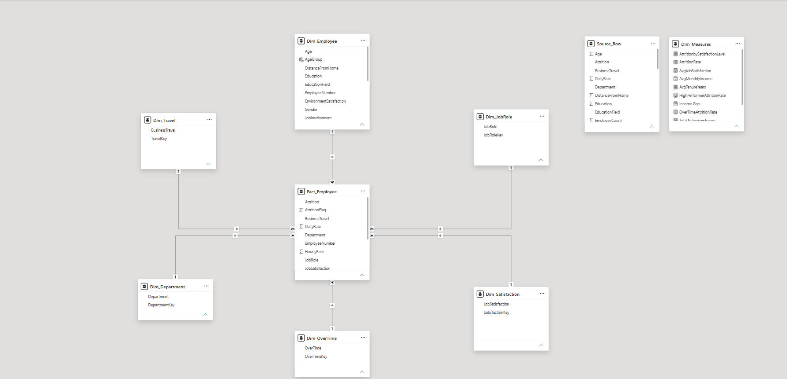
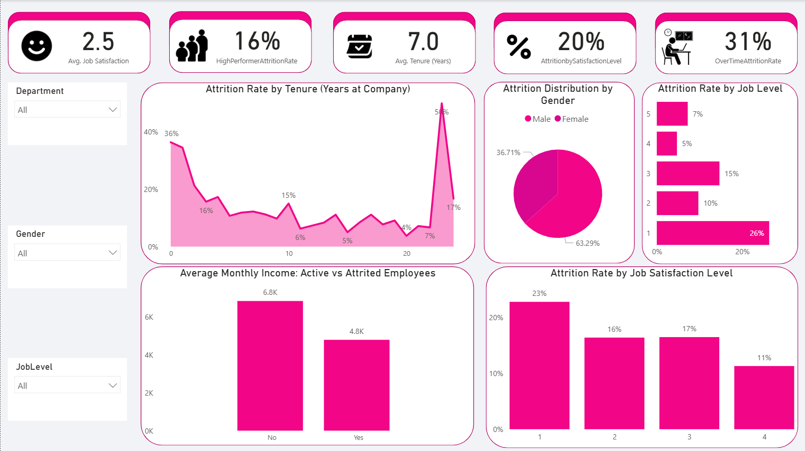

# Employee Attrition Analysis — Power BI Dashboard

Identifying the key drivers of employee turnover using the IBM HR Analytics dataset, built on a star-schema data model with 11 DAX measures.

---

## Business Context

Employee attrition carries significant hiring, training, and lost-productivity costs. This project analyzes the IBM HR Analytics Employee Attrition dataset (1,470 employees) to identify which factors most strongly correlate with employees leaving — overtime, tenure, age, department, job role, compensation, and satisfaction so HR and department leaders can prioritize retention interventions where they will have the most impact.

---

## Data Model

The report is built on a star schema with a central fact table and surrounding dimension tables:

- **Fact_Employee** — one row per employee, including attrition flag, daily rate, hourly rate, job satisfaction, and department
- **Dim_Employee** — demographics: age, age group, education, education field, gender, job involvement
- **Dim_Department** — department classification
- **Dim_JobRole** — job role classification
- **Dim_Satisfaction** — job satisfaction levels
- **Dim_OverTime** — overtime status
- **Dim_Travel** — business travel frequency
- **Dim_Measures** — a disconnected table used to organize the DAX measures below

---

## Approach & Tools

- **Dataset:** IBM HR Analytics Employee Attrition dataset
- **Tools:** Power BI, DAX, Power Query
- **Data Model:** Star schema (above), built to keep dimensions reusable across visuals and slicers

**DAX Measures (11):**

| Measure | What it shows |
|---|---|
| `TotalEmployees` | Total headcount in the dataset |
| `TotalActiveEmployees` | Count of employees currently active |
| `TotalAttritions` | Count of employees who have left |
| `AttritionRate` | Overall attrition rate (attritions ÷ total employees) |
| `AvgMonthlyIncome` | Average monthly income across all employees |
| `AvgTenureYears` | Average years at the company |
| `AvgJobSatisfaction` | Average job satisfaction score |
| `AttritionbySatisfactionLevel` | Attrition rate among employees with low job satisfaction (≤2) |
| `OverTimeAttritionRate` | Attrition rate among employees working overtime |
| `HighPerformerAttritionRate` | Attrition rate among employees rated as high performers (rating ≥3) |
| `Income Gap` | Difference in average monthly income between leavers and stayers |

---

## Dashboard Screenshots

**Overview — headcount, departments, age groups, job roles, overtime**

**Attrition Drivers — satisfaction, tenure, gender, job level, income**

---

## Key Insights

- **Overall attrition sits at 16%** (237 of 1,470 employees) — the baseline against which any retention initiative should be measured.
- **Overtime is the strongest single driver identified:** employees working overtime show a **31% attrition rate**, roughly **3x higher** than the 10% rate for those who don't.
- **The first year is the highest-risk period:** attrition is **36% at year 0**, then drops and fluctuates between roughly 4–17% through years 1–20 — a classic early-tenure "drop-off" pattern.
- **Younger employees leave at much higher rates:** the under-25 group shows **39% attrition**, more than double the 25–34 group (20%) and nearly 4x the 35–54 groups (~10%).
- **Sales is the highest-risk area:** the Sales department has the highest departmental attrition rate (**21%**), and within roles, **Sales Representative tops every job role at 40% attrition**.
- **Compensation gap between leavers and stayers:** employees who left earned **4.8K/month on average vs 6.8K/month** for those who stayed — an **Income Gap of roughly -2.05K**, suggesting pay competitiveness may compound other risk factors.
- **Entry-level roles attrite more:** Job Level 1 shows **26% attrition** vs just 5% at Job Level 4.
- **Satisfaction correlates with attrition, though not perfectly linearly:** Job Satisfaction Level 1 shows 23% attrition vs 11% at Level 4, while average job satisfaction overall sits at 2.5/4.
- **A late-tenure spike (~26–27 years) reaches 50% attrition** — likely a small-sample effect tied to retirement timing, but worth flagging for further investigation rather than acting on directly.

---

## Recommendations

- **Review overtime policy**, particularly in Sales and R&D, where the overtime-attrition gap is most pronounced — consider workload redistribution or overtime caps for at-risk roles.
- **Strengthen first-year onboarding and early-tenure engagement programs**, given the steep drop from year-0 attrition (36%) to subsequent years.
- **Re-examine compensation bands for high-risk roles** (Sales Representative, Lab Technician, HR) — the ~2K monthly income gap between leavers and stayers suggests pay may be a contributing factor.
- **Target retention efforts at Job Level 1 and under-25 employees**, the two groups with the clearest elevated attrition — mentorship and career-pathing programs are natural fits.
- **Investigate the late-tenure (26–27 year) spike** separately to confirm whether it reflects retirement timing or a data quality issue before drawing conclusions.
