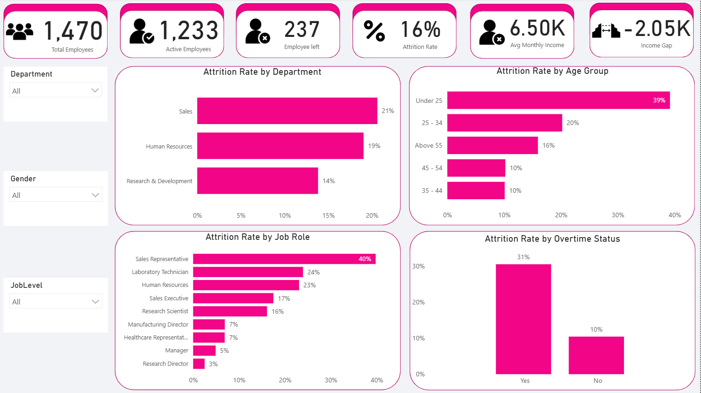

# Employee Attrition Analysis — Power BI Dashboard
Identifying key drivers of employee turnover using the IBM HR Analytics dataset, with a star-schema data model and DAX-based KPIs.

## Business Context
Employee attrition carries significant hiring, training, and productivity costs. This project analyzes the IBM HR Analytics Employee Attrition dataset to identify which factors most strongly correlate with employees leaving department, overtime, tenure, compensation, satisfaction scores so HR and department leaders can prioritize retention interventions where they'll have the most impact.

## Approach & Tools
- **Dataset:** IBM HR Analytics Employee Attrition dataset
- **Tools:** Power BI, DAX, Power Query
- **Data Model:** Star schema with a central employee fact table and dimension tables for department, job role, education field, and demographics
- **DAX Measures:** 10 calculated measures including attrition rate, average tenure by department, overtime attrition ratio, and salary band attrition rate

  ## Dashboard Screenshots

## Recommendations
- Review overtime policies in high-attrition departments, particularly Sales.
- Strengthen onboarding and early-tenure engagement programs for employees in their first two years.
- Introduce regular satisfaction check-ins for roles flagged as high-risk.
